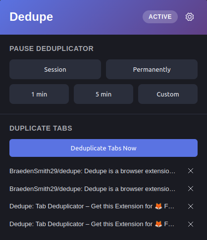

# Dedupe: Tab Deduplicator

A Firefox browser extension that automatically closes duplicate tabs as you browse.

**[Install on Firefox](https://addons.mozilla.org/en-US/firefox/addon/dedupe-tab-deduplicator/) · [Dev Logs](https://www.notion.so/314f73caf2dd81d19c1dfc2e6fd4cd03)**

> Due to Manifest V3 restrictions in Chromium, this extension is Firefox-only.

---

## 📖 Background

This came out of a habit of re-opening the same Jira tickets over and over because they'd get buried in tab groups. I'd end up with several copies of the same page and no easy way to clean them up. The extension handles that automatically. When you open a tab that's already open, it redirects you to the existing one (or closes the old one, depending on your settings).

---

## ✨ Features

**Automatic deduplication**: Detects duplicate tabs on open and handles them based on your configured behavior.

**Popup with duplicate viewer**: Lists current duplicate tabs so you can close them individually or all at once.

**Pause toggle**: Temporarily disable the extension via keybinding or popup. The icon reflects the current state.

**Keybindings**
- Toggle pause
- Detach the current tab (or selected tabs) into a new window

**Domain whitelist/blacklist**: Exclude specific domains from deduplication.

**Configurable behavior**
- Which navigation types trigger deduplication (new tabs, new windows, redirects, etc.)
- Whether to close the new tab or the existing one
- Whether to auto-focus the surviving tab
- URL comparison logic



---

## 🛠️ Tech Stack

| | |
|---|---|
| **Language** | TypeScript |
| **Markup/Styles** | HTML / CSS |
| **Bundler** | ESBuild |
| **Platform** | WebExtensions API (Firefox / Manifest V3) |

No frameworks — ESBuild is the only tooling, used to bundle module imports across `popup.ts` and `background.ts`.

---

## ⚙️ How It Works

A background script listens to browser tab and window events. When a tab starts loading, a `TabTracker` state machine collects lifecycle data across multiple events before making a deduplication decision. Once enough information is available, it checks for existing tabs with a matching URL and acts accordingly.

Two notable engineering problems:

- **Race conditions** — Browser events don't fire in a guaranteed order. Acting on any single event was unreliable, so the state machine approach collects data across events and defers the decision until it has everything it needs.
- **Synchronous cache requirement** — Certain WebExtensions API features (like keybinding listeners) require synchronous handlers. Since browser storage queries are async, this required refactoring the settings layer into a `StorageCache` abstract class that hydrates at startup and stays current via `browser.storage.onChanged`, allowing all downstream getters to be synchronous.

More detail on both in the [dev logs](https://www.notion.so/314f73caf2dd81d19c1dfc2e6fd4cd03).

---

## 📦 Installation

**Firefox Add-Ons store:**

[Install Dedupe](https://addons.mozilla.org/en-US/firefox/addon/dedupe-tab-deduplicator/)

**From source:**

```bash
git clone https://github.com/BraedenSmith29/dedupe.git
cd dedupe
npm install
npm run build
```

Load the `build/` folder as a temporary extension in Firefox via `about:debugging`.

---

## 📝 Dev Logs

Detailed logs covering decisions, architecture changes, and the problems encountered throughout development.

[Read on Notion](https://www.notion.so/314f73caf2dd81d19c1dfc2e6fd4cd03)